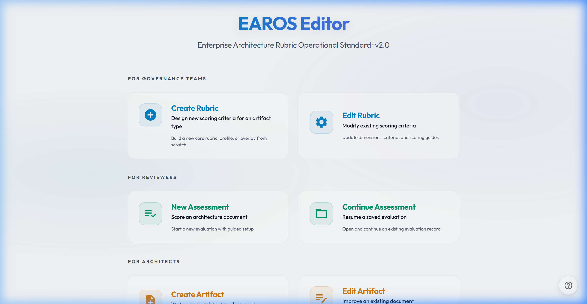
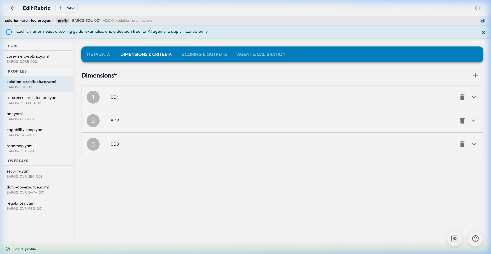
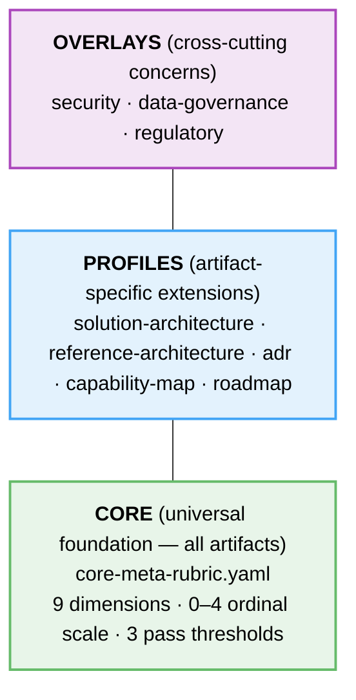
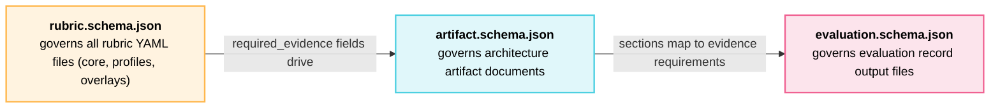

# EaROS — Enterprise Architecture Rubric Operational Standard

[](https://creativecommons.org/licenses/by/4.0/)
[](https://github.com/ThomasRohde/EAROS)

**March 2026** · [github.com/ThomasRohde/EAROS](https://github.com/ThomasRohde/EAROS)

EaROS is a structured, extensible framework for evaluating enterprise architecture artifacts. It provides a universal rubric foundation, artifact-specific profiles, and cross-cutting overlays that together enable consistent, evidence-anchored assessment — by human reviewers and AI agents alike.

<p align="center">
  
  
</p>

> EaROS is to architecture review what a marking rubric is to an exam: it makes the criteria explicit, the scoring reproducible, and the feedback actionable.

---

## What is EaROS?

Architecture artifacts — solution designs, ADRs, capability maps, reference architectures, roadmaps — are evaluated constantly, but rarely consistently. Different reviewers apply different mental models. Review boards drift. AI-generated assessments hallucinate quality where there is none.

EaROS solves this by codifying evaluation criteria into governed, machine-readable rubrics. Each criterion has precise descriptors for every score level, mandatory evidence requirements, and unambiguous pass/fail gates. The result is architecture governance that scales: from a single architect reviewing a colleague's design, to an AI agent running nightly quality checks across hundreds of artifacts.

### Design Principles

1. **Concern-driven, not document-driven** — assess what matters to stakeholders, not just completeness
2. **Evidence first** — every score requires a cited excerpt or reference, not an impression
3. **Gates before averages** — critical failures cannot be hidden by high scores elsewhere
4. **Explainability over false precision** — ordinal scores with verbal anchors beat decimal averages
5. **Separate observation from inference** — what the artifact says vs. what it implies are different things
6. **Rubrics are governed assets** — versioned, owned, calibrated, not ad hoc checklists
7. **Agentic use must remain auditable** — AI evaluations must cite evidence and flag uncertainty
8. **Machine-readable where possible** — artifacts in structured formats are assessed more reliably

---

## The Three-Layer Model



**Core** defines the nine dimensions that apply to every architecture artifact: stakeholder fit, scope clarity, concern coverage, traceability, internal consistency, risk coverage, compliance, actionability, and maintainability.

**Profiles** extend the core with artifact-specific dimensions. The solution-architecture profile adds optioning and quality-attribute criteria. The reference-architecture profile adds views, prescriptiveness, golden-path, and reusability criteria. Each profile inherits the core and adds 4–12 additional criteria.

**Overlays** inject cross-cutting criteria on top of any core+profile combination. Apply the security overlay when reviewing a design that touches authentication or data handling, regardless of its artifact type.

---

## Three Schema Types

EaROS uses three distinct JSON Schemas in `standard/schemas/`, forming a deliberate derivation chain:



| Schema | Validates | Kind discriminator |
|--------|-----------|--------------------|
| `rubric.schema.json` | Core rubrics, profiles, overlays | `kind: core_rubric`, `profile`, `overlay` |
| `evaluation.schema.json` | Evaluation records | `kind: evaluation` |
| `artifact.schema.json` | Architecture artifact documents | `kind: artifact` |

A well-completed artifact document satisfies the evidence requirements that rubric criteria require. When a profile adds criteria with new `required_evidence` fields, the artifact schema should be extended to add the corresponding sections. This chain makes EaROS end-to-end: rubric defines what counts as evidence → artifact schema structures how evidence is captured → evaluation schema records how it is scored. The artifact schema is also used by the editor's JSON Forms to render a structured artifact creation form.

---

## Repository Structure

```
EAROS/
├── earos.manifest.yaml              Inventory of all rubric files (single source of truth)
│
├── standard/                        Standard documents and JSON schemas
│   ├── EAROS.md                     The EaROS standard (canonical reference)
│   ├── EAROS_Standard_v2.docx       Word version of the standard
│   └── schemas/
│       ├── rubric.schema.json       JSON Schema for core rubric / profile / overlay files
│       ├── evaluation.schema.json   JSON Schema for evaluation record files
│       └── artifact.schema.json     JSON Schema for architecture artifact documents
│                                    (derived from rubric required_evidence fields)
│
├── core/
│   └── core-meta-rubric.yaml        Universal rubric — applies to all artifacts
│
├── profiles/                        Artifact-specific rubric extensions
│   ├── solution-architecture.yaml
│   ├── reference-architecture.yaml
│   ├── adr.yaml
│   ├── capability-map.yaml
│   └── roadmap.yaml
│
├── overlays/                        Cross-cutting concern injectors
│   ├── security.yaml
│   ├── data-governance.yaml
│   └── regulatory.yaml
│
├── templates/                       Blank templates for assessors and authors
│   ├── new-profile.template.yaml    Scaffold for creating a new profile
│   └── evaluation-record.template.yaml  Blank evaluation record
│
├── tools/
│   ├── scoring-sheets/              Excel-based tool for manual assessment
│   │   └── EAROS_Scoring_Sheet_v2.xlsx
│   ├── validate.py                  Python schema validation utility
│   └── editor/                      Browser-based YAML editor + CLI (React + JSON Forms + Vite)
│       ├── bin.js                   CLI entry point (earos command)
│       ├── scaffold/                Bundled workspace scaffold (copied by earos init)
│       │   ├── core/, profiles/, overlays/, templates/, standard/schemas/
│       │   ├── .agents/skills/      10 agent skills (agent-agnostic)
│       │   ├── .claude/CLAUDE.md    Claude Code discovery shim (points to AGENTS.md)
│       │   ├── AGENTS.md            Full project guide for AI agents
│       │   └── earos.manifest.yaml
│       ├── src/
│       │   ├── components/          HomeScreen, AssessmentWizard, ArtifactEditor,
│       │   │                        RubricEditor, CriterionScorer, HelpDialog, …
│       │   └── utils/               schemaLoader, validate, yaml helpers
│       └── README.md
│
├── examples/
│   └── example-solution-architecture.evaluation.yaml  Worked evaluation
│
├── calibration/                     Calibration infrastructure
│   ├── gold-set/                    Reference artifacts with known scores
│   └── results/                     Calibration run outputs
│
├── research/                        Research underpinning the standard (63 sources)
│   ├── architecture-assessment-rubrics-research.md
│   └── reference-architecture-research.md
│
├── presentations/                   Slide decks for rollout and training
│   ├── EAROS_v2_Part1_Overview.pptx
│   ├── EAROS_v2_Part2_Scoring.pptx
│   └── EAROS_v2_Part3_Implementation.pptx
│
├── docs/                            How-to guides
│   ├── getting-started.md
│   ├── profile-authoring-guide.md
│   └── terminology.md               Glossary of all EaROS, statistical, and architecture terms
│
└── .claude/skills/                  Claude Code skills (wraps .agents/skills/ for Claude Code)
    ├── earos-assess/
    ├── earos-review/
    ├── earos-template-fill/
    ├── earos-artifact-gen/
    ├── earos-create/
    ├── earos-profile-author/
    ├── earos-calibrate/
    ├── earos-report/
    ├── earos-validate/
    └── earos-remediate/
```

---

## File Naming Conventions

The `kind` field is the universal type discriminator — it determines how a file is interpreted, not its filename suffix or path. Version is tracked inside the file (`version: 2.0.0`), never in the filename.

| File type | Pattern | Example |
|-----------|---------|---------|
| Rubric definitions (core, profiles, overlays) | `<name>.yaml` | `reference-architecture.yaml` |
| Evaluation records | `<name>.evaluation.yaml` | `payments-api.evaluation.yaml` |
| Templates | `<name>.template.yaml` | `evaluation-record.template.yaml` |
| JSON schemas | `<name>.schema.json` | `rubric.schema.json` |

- Kebab-case throughout; no spaces in filenames
- No version numbers in filenames — use `version:` inside the file

---

## Scoring Model

### 0–4 Ordinal Scale

| Score | Label | Meaning |
|-------|-------|---------|
| 4 | Strong | Fully addressed, well evidenced, internally consistent, decision-ready |
| 3 | Good | Clearly addressed with adequate evidence and only minor gaps |
| 2 | Partial | Explicitly addressed but coverage incomplete, inconsistent, or weakly evidenced |
| 1 | Weak | Acknowledged or implied, but inadequate for decision support |
| 0 | Absent | No meaningful evidence, or evidence directly contradicts the criterion |
| N/A | Not applicable | Criterion genuinely does not apply to this artifact (requires justification) |

### Gate Types

Gates prevent weak scores being masked by high averages elsewhere.

| Gate Type | Effect |
|-----------|--------|
| `none` | Contributes to score only; no gate logic |
| `advisory` | Weak performance triggers a recommendation |
| `major` | Significant weakness may cap the status (e.g., cannot pass above `conditional_pass`) |
| `critical` | Failure blocks pass status entirely; triggers `reject` regardless of average |

### Status Thresholds

| Status | Threshold |
|--------|-----------|
| **Pass** | No critical gate failure + overall ≥ 3.2 + no dimension < 2.0 |
| **Conditional Pass** | No critical gate failure + overall 2.4–3.19 |
| **Rework Required** | Overall < 2.4, or repeated weak dimensions |
| **Reject** | Any critical gate failure, or mandatory control breach |
| **Not Reviewable** | Evidence too incomplete to score responsibly |

---

## Getting Started

### Install

```bash
npm install -g @trohde/earos
```

### Scaffold a new workspace

```bash
earos init my-architecture
cd my-architecture
earos
```

`earos init` copies a complete, ready-to-use EaROS workspace into `my-architecture/` — all rubrics, schemas, templates, and agent skills bundled. The browser editor opens automatically at `http://localhost:3000`.

---

## earos init — Agent-Agnostic Workspace

`earos init [dir]` scaffolds a self-contained EaROS workspace that works with any AI coding agent:

```
my-architecture/
├── earos.manifest.yaml          Inventory of all rubric files
├── AGENTS.md                    Full project guide — read by Cursor, Copilot, Windsurf, etc.
├── .claude/CLAUDE.md            Thin Claude Code shim — points to AGENTS.md for discovery
├── .agents/skills/              10 EaROS skills in agent-agnostic format
│   ├── earos-assess/
│   ├── earos-review/
│   ├── earos-template-fill/
│   ├── earos-artifact-gen/
│   ├── earos-create/
│   ├── earos-profile-author/
│   ├── earos-calibrate/
│   ├── earos-report/
│   ├── earos-validate/
│   └── earos-remediate/
├── core/core-meta-rubric.yaml
├── profiles/                    5 artifact profiles (solution-architecture, reference-architecture,
│                                adr, capability-map, roadmap)
├── overlays/                    3 cross-cutting overlays (security, data-governance, regulatory)
├── standard/schemas/            JSON Schemas for rubrics, evaluations, and artifacts
├── templates/                   Blank templates for new rubrics and evaluation records
├── evaluations/                 Your evaluation records go here
└── calibration/                 Calibration artifacts and results
```

**Agent-agnostic design:** Skills live in `.agents/skills/` — a convention understood by Cursor, GitHub Copilot, Windsurf, and other AI coding tools. `AGENTS.md` at the repo root is the primary guide for any agent. Claude Code additionally discovers `.claude/CLAUDE.md`, which is a thin shim that points agents to `AGENTS.md` and `.agents/skills/`. Every skill reads the actual YAML rubric files at runtime, so assessments always use the latest rubric version regardless of which agent runs them.

---

## CLI Commands

```bash
earos                              # Open the web editor (http://localhost:3000)
earos init [dir]                   # Scaffold a new agent-agnostic EaROS workspace
earos validate <file>              # Validate a rubric/evaluation/artifact YAML against schemas
earos manifest                     # Regenerate earos.manifest.yaml from the filesystem
earos manifest add <path>          # Add a single file to the manifest
earos manifest check               # Verify manifest matches filesystem (exits non-zero on drift)
```

After creating a new rubric, always run `earos manifest add <path>` to register it.

---

## For Governance Teams — Creating and Managing Rubrics

1. Run `earos` to open the editor, then select **Create Rubric** or **Edit Rubric**
2. Use the `earos-create` agent skill to author a new profile or overlay via guided interview
3. Validate YAML: `earos validate path/to/rubric.yaml`
4. Add to the manifest: `earos manifest add path/to/rubric.yaml`

## For Reviewers — Assessing an Artifact

1. **Identify the artifact type** — solution architecture, ADR, capability map, reference architecture, or roadmap
2. **Select the rubric set:** always start with `core/core-meta-rubric.yaml`, add the matching profile from `profiles/`, add applicable overlays from `overlays/`
3. **Score using one of:**
   - **Browser editor:** `earos` — guided wizard with criterion-by-criterion scoring
   - **Spreadsheet:** open `tools/scoring-sheets/EAROS_Scoring_Sheet_v2.xlsx`
   - **Agent skill:** use the `earos-assess` skill in your AI coding agent
4. **Check gates** — any critical gate failure overrides the aggregate score
5. **Determine status** against the thresholds above

See [`docs/getting-started.md`](docs/getting-started.md) for a full walkthrough.

## For Architects — Writing an Assessment-Ready Artifact

1. Use the `earos-artifact-gen` skill — it interviews you and produces a schema-compliant artifact YAML
2. Or use the `earos-template-fill` skill — it guides you through writing each section to satisfy rubric evidence requirements
3. Or open the editor and select **Create Artifact** on the home screen
4. Validate against `standard/schemas/artifact.schema.json`

## AI-Agent Assessment

EaROS is designed for automated evaluation. The YAML rubric files are the machine-readable specification; the evaluation record schema defines the output format.

**Minimal agent prompt pattern:**

```
You are an architecture quality assessor. Apply the EaROS rubric defined in
[rubric YAML] to the artifact below. For each criterion:
  1. Extract the relevant evidence from the artifact (direct quote or reference)
  2. Score 0–4 against the level descriptors
  3. If you cannot find evidence, score N/A and explain
  4. Flag any gate criteria that fail
  5. Classify evidence as observed / inferred / external
  6. Report confidence (high/medium/low) separately from the score
Produce output conforming to evaluation.schema.json.

<artifact>
[artifact content]
</artifact>
```

The rubric files define an 8-step evaluation DAG:

```mermaid
flowchart LR
    S1[structural<br>validation] --> S2[content<br>extraction]
    S2 --> S3[criterion<br>scoring]
    S3 --> S4[cross_reference<br>validation]
    S4 --> S5[dimension<br>aggregation]
    S5 --> S6[challenge<br>pass]
    S6 --> S7[calibration]
    S7 --> S8[status<br>determination]

    style S1 fill:#f5f5f5,stroke:#9e9e9e,color:#000
    style S2 fill:#f5f5f5,stroke:#9e9e9e,color:#000
    style S3 fill:#f5f5f5,stroke:#9e9e9e,color:#000
    style S4 fill:#f5f5f5,stroke:#9e9e9e,color:#000
    style S5 fill:#f5f5f5,stroke:#9e9e9e,color:#000
    style S6 fill:#f5f5f5,stroke:#9e9e9e,color:#000
    style S7 fill:#f5f5f5,stroke:#9e9e9e,color:#000
    style S8 fill:#4caf50,stroke:#2e7d32,color:#fff
```



Calibrate your agent against `calibration/gold-set/` before production use. Target inter-rater reliability of Cohen's κ > 0.70.

---

## Agent Skills

EaROS ships 10 agent skills for end-to-end workflows. In scaffolded workspaces (`earos init`) they live in `.agents/skills/` — readable by any AI coding agent (Cursor, Copilot, Windsurf, Claude Code, etc.). In the EaROS development repo they additionally appear as Claude Code skills in `.claude/skills/`.

Every skill reads the actual YAML rubric files at runtime — no embedded rubric content — so assessments always use the latest rubric version.

| Skill | Purpose |
|-------|---------|
| `earos-assess` | Run a full EaROS evaluation on any architecture artifact (8-step DAG, RULERS protocol) |
| `earos-review` | Challenge an existing evaluation record — check for over-scoring and unsupported claims |
| `earos-template-fill` | Guide an artifact author through writing an assessment-ready document |
| `earos-artifact-gen` | Guided interview → produces a schema-compliant artifact YAML document |
| `earos-create` | Create a new rubric from scratch — profile, overlay, or core rubric |
| `earos-profile-author` | Technical YAML authoring guide — v2 field structure, schema compliance |
| `earos-calibrate` | Run calibration exercises and compute inter-rater reliability metrics |
| `earos-report` | Generate executive reports and portfolio dashboards from evaluation records |
| `earos-validate` | Health-check the repository — schema validation, ID uniqueness, cross-reference checks |
| `earos-remediate` | Generate a prioritized improvement plan from an EaROS evaluation record |

---

## The EaROS Editor

A browser-based tool for creating and editing EaROS rubrics, running assessments, and authoring artifact documents. Built with React + JSON Forms + Material UI + Vite.

When installed globally (`npm install -g @trohde/earos`), use the `earos` command from any workspace. When working in the development repo directly:

```bash
cd tools/editor
npm install
node bin.js                              # open home screen in browser (http://localhost:3000)
node bin.js ../../profiles/adr.yaml     # open editor with a file pre-loaded
node bin.js validate path/to/file.yaml  # validate a file, exit 0 (valid) / 1 (errors)
node bin.js manifest                    # regenerate earos.manifest.yaml from filesystem
node bin.js manifest add <path>         # add a single file to the manifest
node bin.js manifest check              # check manifest matches filesystem; exits non-zero on drift
```

**Home screen — 3×2 card layout:**

| Audience | Card 1 | Card 2 |
|----------|--------|--------|
| **Governance Teams** | Create Rubric | Edit Rubric |
| **Reviewers** | New Assessment | Continue Assessment |
| **Architects** | Create Artifact | Edit Artifact |

**Key features:**
- **Assessment wizard** — guided criterion-by-criterion scoring with evidence capture, gate tracking, and automatic status determination
- **Artifact editor** — structured document editor driven by `artifact.schema.json`; shows EaROS evidence requirements inline
- **Rubric editor** — tabbed JSON Forms view: Metadata / Dimensions & Criteria / Scoring & Outputs / Agent & Calibration
- **Manifest-driven sidebar** — browse and load any rubric file via `earos.manifest.yaml`; no hardcoded paths
- **Schemas loaded via API** — schemas are served from the canonical `standard/schemas/` paths at runtime
- **Live YAML preview** — right panel updates in real time; copy-to-clipboard button
- **Real-time validation** — status bar shows error count and first errors as you type

See [`tools/editor/README.md`](tools/editor/README.md) for full documentation.

---

## Extending EaROS

### Creating a New Profile

Use [`templates/new-profile.template.yaml`](templates/new-profile.template.yaml) as your scaffold, or run the `earos-create` agent skill for a guided interview. The [`docs/profile-authoring-guide.md`](docs/profile-authoring-guide.md) describes five design methods:

- **Method A: Decision-Centred** — for ADRs, investment reviews
- **Method B: Viewpoint-Centred** — for capability maps, reference architectures
- **Method C: Lifecycle-Centred** — for transitions, roadmaps, handover docs
- **Method D: Risk-Centred** — for security, regulatory, resilience architecture
- **Method E: Pattern-Library** — for recurring platform services

Rules: set `kind: profile`, `inherits: [EAROS-CORE-002]`, add 5–12 criteria (the core already has 10), include all required fields for every criterion (`question`, `description`, `scoring_guide`, `required_evidence`, `anti_patterns`, `examples.good`, `examples.bad`, `decision_tree`, `remediation_hints`), validate against `rubric.schema.json`, then add to the manifest.

### Creating a New Overlay

Use `kind: overlay` and `artifact_type: any`. Overlays use `scoring.method: append_to_base_rubric` — they add criteria on top of any core+profile combination. Apply overlays by context, not artifact type. Overlays are additive and cannot weaken base gates.

### Calibrating Before Production

1. Score the artifacts in `calibration/gold-set/` independently
2. Compare against reference scores using `calibration/results/`
3. Resolve disagreements against the level descriptors
4. Iterate until κ > 0.70 on well-defined criteria, > 0.50 on subjective ones

---

## Glossary

New to EaROS terminology? The standard uses precise vocabulary from statistics, architecture practice, and the EaROS framework itself. See [`docs/terminology.md`](docs/terminology.md) for definitions of all key terms, organized into three categories:

- **Statistical and calibration terms** — Cohen's kappa, weighted kappa, ICC, Spearman's rho, Wasserstein distance, inter-rater reliability, calibration
- **EaROS-specific terms** — core meta-rubric, profile, overlay, gate, evidence anchor, evidence class, RULERS protocol, DAG evaluation flow, challenge pass, rubric locking, decision tree
- **Architecture terms** — architecture artifact, viewpoint, quality attribute, quality attribute scenario, fitness function, ADR, golden path, concern

---

## Standards and Research Foundation

EaROS draws on and extends:

- **TOGAF** Architecture Content Framework and governance practices
- **arc42** template structure and quality criteria
- **C4 Model** viewpoint hierarchy
- **RULERS** protocol for evidence-anchored rubric scoring
- **LLM-Rubric** and **AutoRubric** research on AI-agent evaluation reliability
- AWS/Azure/Google Well-Architected Frameworks

Full research documentation is in [`research/`](research/).

---

## Author

Thomas Rohde · [rohde.thomas@gmail.com](mailto:rohde.thomas@gmail.com) · [github.com/ThomasRohde](https://github.com/ThomasRohde)

---

## Contributing

Contributions to profiles, overlays, calibration artifacts, and documentation are welcome. When contributing:

- Use `<artifact-type>.yaml` for rubric files (no version number in filename)
- Validate YAML files against the JSON schemas in `standard/schemas/`
- Include level descriptors (0–4) and evidence requirements for every new criterion
- Add worked examples to `examples/` when introducing new profiles
- Document changes in `CHANGELOG.md`

---

## License

This work is licensed under the [Creative Commons Attribution 4.0 International License](LICENSE) (CC BY 4.0).

You are free to use, adapt, and build upon EaROS for any purpose, including commercial, provided you give appropriate credit.
